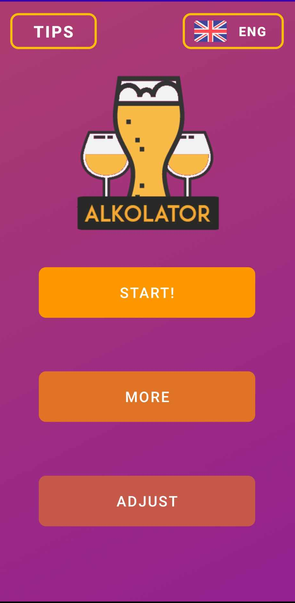
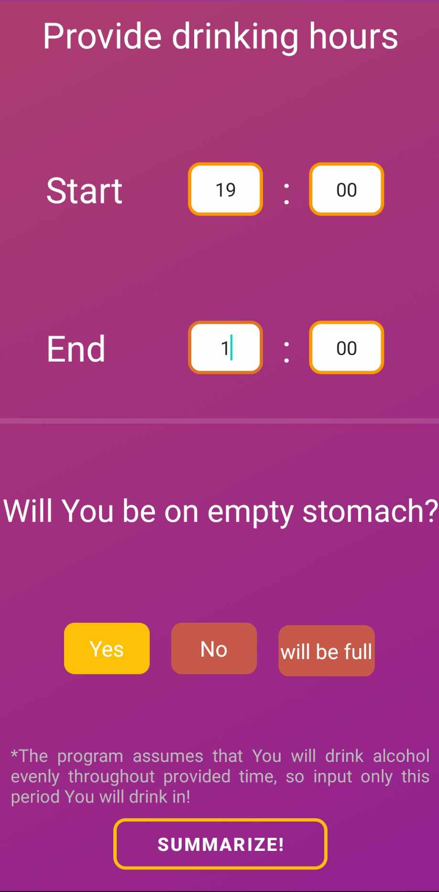
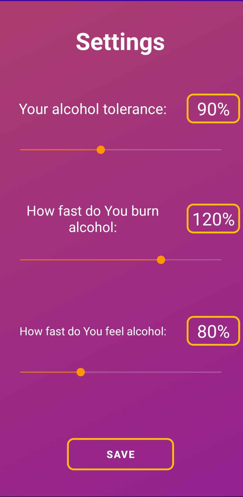
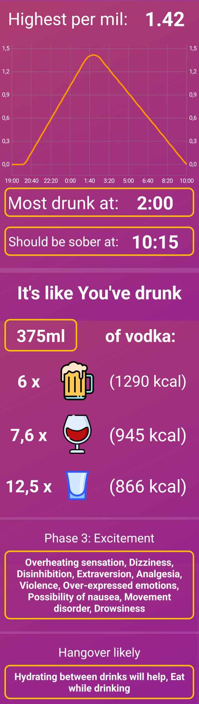

# Alcolator
## Mobile app for estimating alcohol intoxication levels
This project was my first attempt at creating a mobile app, and it was available on Google Play. The app estimates alcohol intoxication levels and predicts when the user will sober up. It also manages donations through in-app transactions.
## Screenshots

  
  
  

